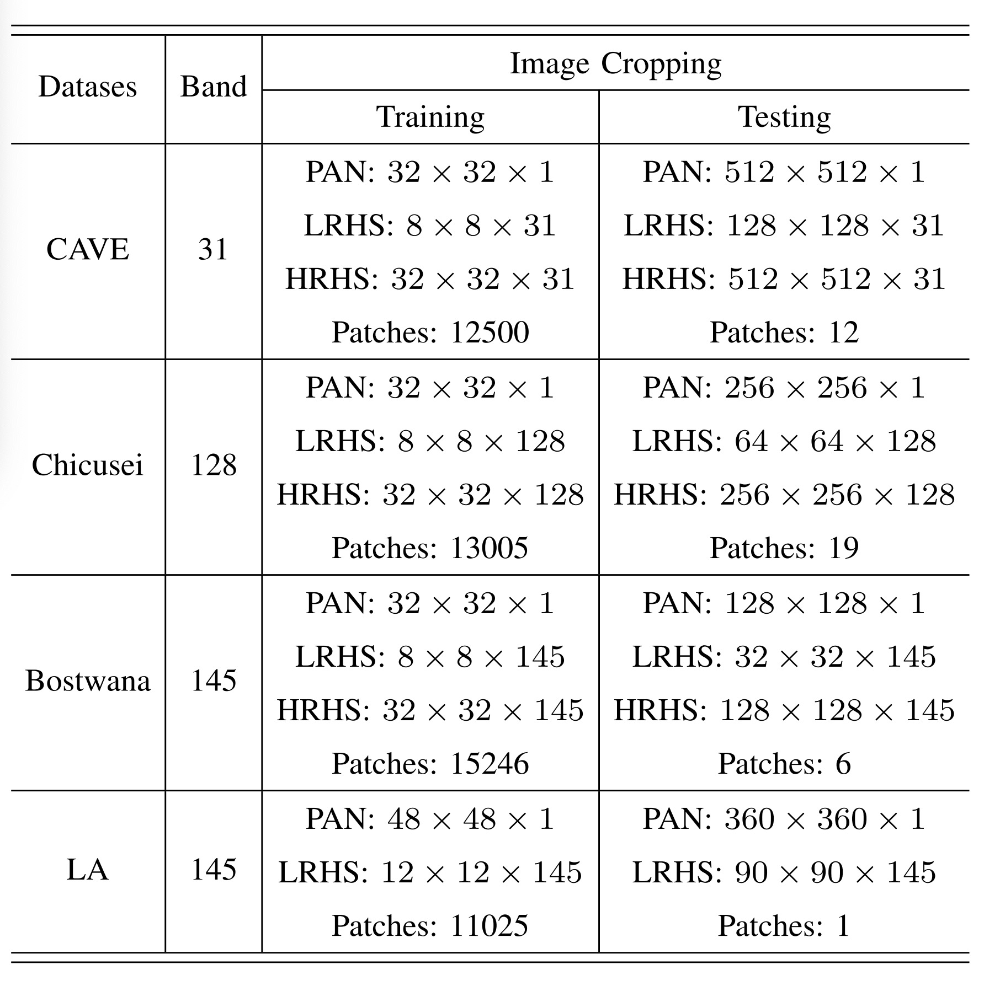

# MFT-GAN: A Multiscale Feature-Guided Transformer Network for Unsupervised Hyperspectral Pansharpening, IEEE TGRS, 2024

## Original data download
CAVE: https://www1.cs.columbia.edu/CAVE/databases/multispectral/

Chikusei: https://naotoyokoya.com/Download.html

Bostwana: https://www.ehu.eus/ccwintco/index.php/Hyperspectral_Remote_Sensing_Scenes#Bostwana

Los Angeles: https://github.com/yxzheng24/IEEE_TGRS_DHP-DARN/tree/main/data_process/LosAngelesData

# Sample data generation
### run data/data_sample_generation.py

## Run
### run `main.py`

